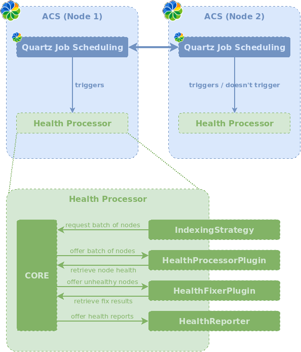

# Alfresco Health Processor

[](http://search.maven.org/#search%7Cga%7C1%7Cg%3A%22eu.xenit.alfresco%22%20AND%20a%3A%22alfresco-health-processor-platform%22)
[](https://javadoc.io/doc/eu.xenit.alfresco/alfresco-health-processor-api)
[](https://github.com/xenit-eu/alfresco-health-processor/actions?query=workflow%3ACI+branch%3Amaster)
[](https://www.gnu.org/licenses/lgpl-3.0)

> [](https://xenit.eu/open-source)
>
> Alfresco Health Processor is a part of the Xenit Open Source Tooling around Alfresco. Xenit is company with a 
> big expertise and a strong team around Alfresco. If you'd like to learn more about 
> our [tools](https://xenit.eu/open-source), [services](https://xenit.eu/alfresco) and 
> [products](https://xenit.eu/alfresco-products), please visit our [website](https://xenit.eu).

A background processor capable of performing various operations on the nodes in your Alfresco repository, in a batched
and controlled manner.

## Usage

Alfresco Health Processor is available in Maven Central as an
[Alfresco Module Package](https://docs.alfresco.com/6.2/concepts/dev-extensions-packaging-techniques-amps.html).

### Alfresco Gradle SDK

```groovy
// Alfresco Module Package:
alfrescoAmp "eu.xenit.alfresco:alfresco-health-processor-platform:${last - version}@amp"
```

### Alfresco Maven SDK

```xml
<!-- Alfresco Module Package: -->
<dependency>
    <groupId>eu.xenit.alfresco</groupId>
    <artifactId>alfresco-health-processor-platform</artifactId>
    <version>${last-version}</version>
    <type>amp</type>
</dependency>
```

### Manual download and install

Please consult the official Alfresco documentation on how to install Module Packages manually.

### Supported Alfresco versions

The module is systematically integration tested against Alfresco 7.1, 7.2, 7.4
Please use a previous version of the health-processor for older versions of alfresco.


## Overview

Alfresco Health Processor is a custom
[Alfresco subsystem](https://docs.alfresco.com/content-services/latest/develop/repo-ext-points/subsystems/)
that is able to perform various node related operations such as integrity validation or even rectification.



Triggered as
a [scheduled job](https://docs.alfresco.com/content-services/community/develop/repo-ext-points/scheduled-jobs/), the
processor will iterate over (a subset of) the nodes in Alfresco. The nodes are processed in batches of a predefined size
and are offered to plugins for processing. Each plugin can optionally return reports that contain information about the
health status of the nodes in the processed batch. After the batch has been processed, the platform will offer the
reports to available health reporters.

All interactions done by the Health Processor are highly customizable and extensible. To iterate over batches of nodes,
a single `IndexingStrategy` is used. Batches of nodes are offered for processing to all enabled `HealthProcessorPlugin`
implementations. Reports indicating unhealthy nodes are sent to all enabled `HealthFixerPlugin` implementations that can
try to automatically resolve the problem. The resulting reports will be offered for processing to all available `HealthReporter` implementations.

### Core configuration

* `eu.xenit.alfresco.healthprocessor.task.cron=* * * * * ? 2099`  
  The cron schedule that will initially startup the process.
* `eu.xenit.alfresco.healthprocessor.task.delay=0`  
  An optional delay before the processor starts.
* `eu.xenit.alfresco.healthprocessor.processing.node-batch-size=1000`  
  Node batch size of the processing. This is the size of the batch that will be requested from the `IndexingStategy`
  and the size of the batches offered to the `HealthProcessorPlugin` implementations
* `eu.xenit.alfresco.healthprocessor.processing.max-batches-per-second=-1`
  Optional rate limitation to minimize load on the system. This number indicates the maximum number of batches each
  plugin may process each second. A number smaller than or equal to 0 indicates no rate limiting is applied.
* `eu.xenit.alfresco.healthprocessor.processing.read-only=true`  
  The Health Processor wraps the processing of each batch for each plugin in a new transaction. This property configures
  if this transaction should be read-only.
* `eu.xenit.alfresco.healthprocessor.processing.run-as-user=System`  
  Since the Alfresco Health Processor is basically a scheduled job, it needs to run as a certain user. The default
  is `System` but it is possible to assign a dedicated user.
* `eu.xenit.alfresco.healthprocessor.reports.store.max-stored-reports=3000`
  Maximum number of node reports that are stored and reported at the end of a cycle.
  Additional reports above this number will be dropped, and a warning will be logged when that happens.
  This setting protects you from crashing Alfresco in case a large number of reports is generated during a Health Processor cycle, for example due to an intermittent issue resulting in a large number of nodes being reported unhealthy.


## Admin Console dashboard

To get insight in the current state of the Health-Processor, the module includes a custom
[Repository Admin Console](https://docs.alfresco.com/content-services/latest/admin/admin-console/) dashboard.

This dashboard is read-only. If your system requires the capability to trigger or change the Health-Processor
configuration at runtime, we advise installing and using the
[Order Of The Bee Support tools](https://github.com/OrderOfTheBee/ootbee-support-tools) extension. This module contains
a [command console](https://github.com/OrderOfTheBee/ootbee-support-tools/wiki/Command-Console#subsystems-plugin-commands)
that makes it possible to change and persist Subsystem configuration at runtime. Furthermore it contains an overview
of [scheduled jobs](https://github.com/OrderOfTheBee/ootbee-support-tools/wiki/Scheduled-Jobs) with the possibility to
manually trigger a job.

The Order Of The Bee Support tools works for both Alfresco Community (ACE) and Enterprise Edition (AEE). For AEE it is
also possible to use JMX for persistent subsystem configuration and the out of the box scheduled jobs admin dashboard to
manually trigger the job.

## Out of the box functionality

Next to the core framework, this module contains a list of useful tools that contain basic integrity check for your
Alfresco repository. Please note that all available plugins and reporters are disabled by default and should be enabled
as desired.

### IndexingStrategy implementations

The Health Processor uses a single indexing strategy to iterate over (a subset of) nodes in Alfresco. The active
strategy can be controlled with following property:

```properties
eu.xenit.alfresco.healthprocessor.indexing.strategy=txn-id
```

#### Indexing based on transaction ID

Strategy id: `txn-id`

Loops over (a subset of) nodes based on the ID of transactions in Alfresco.

```properties
eu.xenit.alfresco.healthprocessor.indexing.txn-id.start=-1
eu.xenit.alfresco.healthprocessor.indexing.txn-id.stop=9223372036854775807
eu.xenit.alfresco.healthprocessor.indexing.txn-id.txn-batch-size=5000
```

#### Indexing based on last N transactions

Strategy id: `last-txns`

Loops over a subset of nodes based on the ID of transactions in Alfresco.
Only nodes in the last _N_ transactions are considered, so the only the most recently modified nodes are considered.

Indexing begins at the latest transaction and works its way backwards until `lookback-transactions` transactions with nodes have been processed.

```properties
eu.xenit.alfresco.healthprocessor.indexing.last-txns.lookback-transactions=10000
eu.xenit.alfresco.healthprocessor.indexing.last-txns.txn-batch-size=5000
```

### HealthProcessorPlugin implementations

#### Content Validation

Activation property: `eu.xenit.alfresco.healthprocessor.plugin.content-validation.enabled=true`

Validates that properties of type `d:content` point to content that actually exists in the Alfresco content store.

By default, the plugin will process all properties with type `d:content`. It is also possible to limit this validation
to specific, predefined properties:

```properties
eu.xenit.alfresco.healthprocessor.plugin.content-validation.properties=cm:content,{foobar}baz
```

If this property is not set (which is the default), the plugin will request all properties of type `d:content`
from Alfresco's `DictionaryService`.

#### Solr index Validation

Activation property: `eu.xenit.alfresco.healthprocessor.plugin.solr-index.enabled=true`

Validates that nodes are present in a Solr/Alfresco Search Services index.

By default, the plugin will check the solr server configured with `solr.host` & `solr.port` with the default `alfresco` and `archive` indexes.
> [!WARNING]
> when ussing ssl this needs to be explicitly set to use HTTPS and the solr.port.ssl

It is possible to configure the solr servers to check and, for sharded setups, which nodes should be present in which solr server.

Multiple solr servers (endpoints) can be configured.
A comma-separated list of named endpoints is configured in `eu.xenit.alfresco.healthprocessor.plugin.solr-index.endpoints`.

Properties for a specific endpoint are configured under the `eu.xenit.alfresco.healthprocessor.plugin.solr-index.endpoints.<endpoint>` property:

* `type`: Configures the kind of endpoint selector to use `Always` (for non-sharded Solr setup) or `DbIdRange` (for `DB_ID_RANGE` sharded Solr setup)
* `filter`: Configures a filter for which nodes an endpoint will be used.
  * `Always`: Ignores this parameter
  * `DbIdRange`: Range of node database IDs to be indexed. Same configuration format as `shard.range` for Solr: `<start-id>-<end-id>`.
* `base-uri`: Base URI to the Solr core.
  * solr4: `http://solr-host:8080/solr4/alfresco/`
  * solr6: `http://solr-host:8080/solr/alfresco/`
* `indexed-store`: The store ID from which this Solr core indexes. Usually `workspace://SpacesStore` or `archive://SpacesStore`.

<details>

<summary>Example configuration</summary>

```properties
# This property lists all endpoints that should be checked
eu.xenit.alfresco.healthprocessor.plugin.solr-index.endpoints=solr-old,solr-shard1,solr-shard2

eu.xenit.alfresco.healthprocessor.plugin.solr-index.endpoints.solr-old.type=Always
eu.xenit.alfresco.healthprocessor.plugin.solr-index.endpoints.solr-old.base-uri=http://solr1.example.com:1234/solr4/alfresco/
eu.xenit.alfresco.healthprocessor.plugin.solr-index.endpoints.solr-old.indexed-store=workspace://SpacesStore

eu.xenit.alfresco.healthprocessor.plugin.solr-index.endpoints.solr-shard1.type=DbIdRange
eu.xenit.alfresco.healthprocessor.plugin.solr-index.endpoints.solr-shard1.filter=0-250
eu.xenit.alfresco.healthprocessor.plugin.solr-index.endpoints.solr-shard1.base-uri=http://solr2.example.com:1234/solr/shard1/
eu.xenit.alfresco.healthprocessor.plugin.solr-index.endpoints.solr-shard1.indexed-store=workspace://SpacesStore

eu.xenit.alfresco.healthprocessor.plugin.solr-index.endpoints.solr-shard2.type=DbIdRange
eu.xenit.alfresco.healthprocessor.plugin.solr-index.endpoints.solr-shard2.filter=250-500
eu.xenit.alfresco.healthprocessor.plugin.solr-index.endpoints.solr-shard2.base-uri=http://solr2.example.com:1234/solr/shard2/
eu.xenit.alfresco.healthprocessor.plugin.solr-index.endpoints.solr-shard2.indexed-store=workspace://SpacesStore
```

</details>

##### Solr 2.0
When the health-processor is used for Solr index validation on Search Services 2.0 and upper it is advised to enable `eu.xenit.alfresco.healthprocessor.plugin.solr-index.check-transaction=true`.
This property checks that the document is fully up-to-date with the latest transaction instead of only checking presence in the index in any version.

### HealthFixerPlugin implementations

#### Solr missing node fixer

Activation property: `eu.xenit.alfresco.healthprocessor.fixer.solr-missing-node.enabled=true`

Attempts to fix nodes that are not indexed in Solr as detected by the [Solr index Validation](#solr-index-validation) plugin.

The fixer will send an asynchronous `REINDEX` command to all Solr endpoints that are determined to miss the node.
The Solr server will then re-index the node during its next tracking cycle.

All nodes for which an `REINDEX` command has been succesfully sent are marked as `FIXED`.

> **Note**: Although the nodes are marked as _FIXED_, asynchronous indexing by the Solr server may still fail.
> Currently, this case can not be detected automatically, but a node that does not become _HEALTHY_ in a subsequent
> Health-Processor run should be investigated why it is not being indexed.

#### Solr duplicate node fixer

Activation property: `eu.xenit.alfresco.healthprocessor.fixer.solr-duplicate-node.enabled=true`

Attempts to fix nodes that are duplicated in Solr as detected by the [Solr index Validation](#solr-index-validation) plugin.

The fixer will send an asynchronous `PURGE` command, followed by a `REINDEX` command to all Solr endpoints that are determined to duplicate the node.
The Solr server will then be purge and re-index the node during its next tracking cycle.

All nodes for which an `PURGE` and `REINDEX` commands has been succesfully sent are marked as `FIXED`.

> **Note**: Although the nodes are marked as _FIXED_, asynchronous purging/indexing by the Solr server may still fail.
> Currently, this case can not be detected automatically, but a node that does not become _HEALTHY_ in a subsequent
> Health-Processor run should be investigated why it is not being indexed.

### HealthReporter implementations

#### Alfred Telemetry

Activation property: `eu.xenit.alfresco.healthprocessor.reporter.alfred-telemetry.enabled=true`

Integration with [Alfred Telemetry](https://github.com/xenit-eu/alfred-telemetry) that can be used to expose
HealthProcessor metrics to various monitoring systems.

Exposed metrics:

* `health-processor.active`  
  Available tags: /  
  A gauge with value 0 or 1, indicating if the reporter and hence by extension the Health-Processor is active
* `health-processor.progress`
  Available tags: /
  A gauge with a value between 0.0 and 1.0, indicating the progress of the current Health-Processor cycle
* `health-processor.plugins`  
  Available tags: /  
  A gauge indicating the number of active `HealthProcessorPlugin` implementations.
* `health-processor.reports`  
  Available tags: `status`  (HEALTHY, UNHEALTHY or NONE), `plugin` (the class name of the HealthProcessorPlugin
  implementation).  
  A counter indicating the total number of processed reports, with the specific status and plugin as tag values.

#### Logging

##### Summary

Activation property: `eu.xenit.alfresco.healthprocessor.reporter.log.summary.enabled=true`

A simple implementation that writes, once a Health Processor cycle is completed, a summary and unhealthy nodes to the
Alfresco logs.

> [!WARNING]
> Starting from alfresco 7.4, alfresco has migrated to log4j2. The original log4j logger will no longer exist.
 
Relevant logger (log4j) (pre Alfresco 7.3): `log4j.logger.eu.xenit.alfresco.healthprocessor.reporter.log.SummaryLoggingHealthReporter=INFO`
Relevant logger (log4j2): `logger.eu-xenit-alfresco-healthprocessor.name=eu.xenit.alfresco.healthprocessor`

Example output:

```text
 2021-03-03 12:40:40,273  INFO  [healthprocessor.reporter.SummaryLoggingHealthReporter] [DefaultScheduler_Worker-2] SUMMARY ---
 2021-03-03 12:40:40,273  INFO  [healthprocessor.reporter.SummaryLoggingHealthReporter] [DefaultScheduler_Worker-2] Plugin[ContentValidationHealthProcessorPlugin] generated reports: {HEALTHY=230, UNHEALTHY=1, NONE=630}
 2021-03-03 12:40:40,273  INFO  [healthprocessor.reporter.SummaryLoggingHealthReporter] [DefaultScheduler_Worker-2]  --- 
 2021-03-03 12:40:40,273  WARN  [healthprocessor.reporter.SummaryLoggingHealthReporter] [DefaultScheduler_Worker-2] UNHEALTHY NODES ---
 2021-03-03 12:40:40,274  WARN  [healthprocessor.reporter.SummaryLoggingHealthReporter] [DefaultScheduler_Worker-2] Plugin[ContentValidationHealthProcessorPlugin] (#1): 
 2021-03-03 12:40:40,275  WARN  [healthprocessor.reporter.SummaryLoggingHealthReporter] [DefaultScheduler_Worker-2] 	workspace://SpacesStore/86796712-4dc6-4b8d-973f-a943ef7f23ed: [Property: '{http://www.alfresco.org/model/content/1.0}content', contentUrl: 'store://2021/3/3/12/27/cb664208-abae-4da9-b7ee-81167a43041a.bin']
 2021-03-03 12:40:40,275  WARN  [healthprocessor.reporter.SummaryLoggingHealthReporter] [DefaultScheduler_Worker-2]  --- 
```

##### Streaming

Activation property: `eu.xenit.alfresco.healthprocessor.reporter.log.streaming.enabled=true`

A simple implementation that writes unhealthy nodes to the Alfresco logs when they are reported.

Relevant logger: `log4j.logger.eu.xenit.alfresco.healthprocessor.reporter.log.StreamingLoggingHealthReporter=INFO`

Example output:

```text
2021-10-06 08:08:05,965  WARN  [reporter.log.StreamingLoggingHealthReporter] [DefaultScheduler_Worker-2] Plugin[SolrIndexValidationHealthProcessorPlugin]	FIXED archive://SpacesStore/1ae6f9af-26e4-41ec-8836-29e52210a247: [Node is missing in search index SearchEndpoint(baseUri=http://solr:8080/solr/archive/).]
2021-10-06 08:08:05,965  INFO  [reporter.log.StreamingLoggingHealthReporter] [DefaultScheduler_Worker-2] 		Fix SUCCEEDED: [REINDEX on SearchEndpoint(baseUri=http://solr:8080/solr/archive/) : scheduled]
2021-10-06 08:15:40,655  WARN  [reporter.log.StreamingLoggingHealthReporter] [DefaultScheduler_Worker-1] Plugin[ContentValidationHealthProcessorPlugin]	UNHEALTHY workspace://SpacesStore/960e0488-71e1-4894-8cc4-208a13df9f3d: [Property: '{http://www.alfresco.org/model/content/1.0}content', contentUrl: 'store://2021/10/6/8/7/e0fd5335-ba70-47d1-a452-9d00a23933f7.bin']
```

##### Progress

Activation property: `eu.xenit.alfresco.healthprocessor.reporter.log.progress.enabled=true`

A simple implementation that writes progress of a Health Processor cycle to the Alfresco logs.

Relevant logger: `log4j.logger.eu.xenit.alfresco.healthprocessor.reporter.log.ProgressLoggingHealthReporter=INFO`

Example output:
```text
2021-08-27 08:25:44,150  INFO  [healthprocessor.reporter.ProgressLoggingHealthReporter] [DefaultScheduler_Worker-6] Health-Processor iteration 47% completed. ETA: 00:00:27.000
2021-08-27 08:25:44,196  INFO  [healthprocessor.reporter.ProgressLoggingHealthReporter] [DefaultScheduler_Worker-6] Health-Processor iteration 53% completed. ETA: 00:00:21.000
```

## Extension points

In addition to out of the box functionality, the HealthProcessor is designed to easily add custom plugins, fixers and reporters. All the
`HealthProcessorPlugin`, `HealthFixerPlugin` and `HealthReporter` implementations available in the Spring context will be detected and used by
the Health Processor platform.

The API, containing required interfaces and helpful classes is available in Maven Central and can be added as a
dependency in your project:

```groovy
implementation "eu.xenit.alfresco:alfresco-health-processor-api:${last_version}"
```

```xml

<dependency>
    <groupId>eu.xenit.alfresco</groupId>
    <artifactId>alfresco-health-processor-api</artifactId>
    <version>${last-version}</version>
</dependency>
```

The HealthProcessor is implemented as an Alfresco subsystem to allow configuration and restarts without restarting the whole Alfresco repository.

Your custom extensions can be put in 2 places.  The following table documents both the locations of the required files and advantages/disadvantages of each approach.

<table>
<thead>
  <tr><th></th><th>Main Alfresco context</th><th>HealthProcessor subsystem context</th></tr>
</thead>
<tbody>
<tr>
  <td>Context XML</td><td>`classpath:alfresco/module/*/module-context.xml`</td><td>`classpath:alfresco/module/subsystems/HealthProcessor/default/*-context.xml`</td>
</tr>
<tr>
  <td>Default configuration</td><td>`classpath:alfresco/module/*/alfresco-global.properties`</td><td>`classpath:alfresco/module/subsystems/HealthProcessor/default/*.properties`</td>
</tr>
<tr>
  <td>Re-configuration</td><td>Can only be done with `alfresco-global.properties` and a restart of the repository</td><td>Can be done in `alfresco-global.properties` and restarting the repository AND without restart with the [OOTB Support Tools Command Console](https://github.com/OrderOfTheBee/ootbee-support-tools/wiki/Command-Console#subsystems-plugin-commands).</td>
</tr>
<tr>
  <td>Naming conflicts</td><td>When following best practices when naming the module, no naming conflicts should occur.</td><td>Take care to use an unique name for context & properties files, as they are in a shared namespace.</td>
</tr>
<tr>
<td>Deploying extension with a Simple Module</td><td>Possible</td><td>Not supported</td>
</tr>
</tbody>
</table>

### HealthProcessorPlugin

[`HealthProcessorPlugin` API](https://javadoc.io/doc/eu.xenit.alfresco/alfresco-health-processor-api/latest/eu/xenit/alfresco/healthprocessor/plugins/api/HealthProcessorPlugin.html)

Main extension point for plugging in custom health checking logic into the Health-Processor.

It creates a [`NodeHealthReport`](https://javadoc.io/doc/eu.xenit.alfresco/alfresco-health-processor-api/latest/eu/xenit/alfresco/healthprocessor/reporter/api/NodeHealthReport.html) for each Alfresco node that it has checked.

An [example plugin](integration-tests/src/main/java/eu/xenit/alfresco/healthprocessor/example/ExampleHealthProcessorPlugin.java)
is included as part of the integration tests of this project.

### HealthFixerPlugin

[`HealthFixerPlugin` API](https://javadoc.io/doc/eu.xenit.alfresco/alfresco-health-processor-api/latest/eu/xenit/alfresco/healthprocessor/fixer/api/HealthFixerPlugin.html)

Extension point for plugging in logic into the Health-Processor to fix unhealthy nodes.

It handles unhealthy `NodeHealthReport`s from a `HealthProcessorPlugin`, tries to fix the unhealthy nodes and emits a [`NodeFixReport`](https://javadoc.io/doc/eu.xenit.alfresco/alfresco-health-processor-api/latest/eu/xenit/alfresco/healthprocessor/fixer/api/NodeFixReport.html) with the results of the fix.

### HealthReporter

[`HealthReporter` API](https://javadoc.io/doc/eu.xenit.alfresco/alfresco-health-processor-api/latest/eu/xenit/alfresco/healthprocessor/reporter/api/HealthReporter.html)

Extension point for plugging in reporting logic into the Health-Processor.

The methods of an HealthReporter are called at specific points in the Health-Processor lifecycle and can be used to
handle the reporting of `NodeHealthReport`s.

## Configuration reference

The [default property file of the HealthProcessor subsystem](alfresco-health-processor-platform/src/main/amp/config/alfresco/subsystems/HealthProcessor/default/heathprocessor.properties)
contains an overview of all configuration and their default values. 
