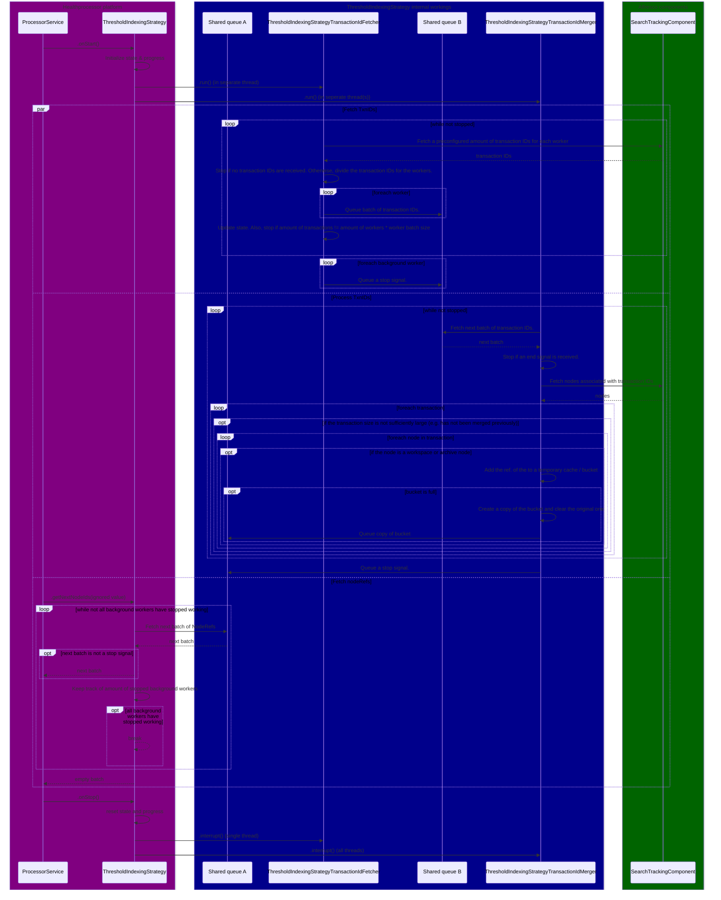

```mermaid
sequenceDiagram
    box Purple Healthprocessor platform
    participant ProcessorService
    participant ThresholdIndexingStrategy
    end
    box Darkblue ThresholdIndexingStrategy internal workings
    participant Shared queue A
    participant ThresholdIndexingStrategyTransactionIdFetcher
    participant Shared queue B
    participant ThresholdIndexingStrategyTransactionIdMerger
    end
    box Darkgreen Alfresco components
    participant SearchTrackingComponent
    end

    
    ProcessorService->>ThresholdIndexingStrategy: .onStart()
    ThresholdIndexingStrategy->>ThresholdIndexingStrategy: Initialize state & progress
    ThresholdIndexingStrategy->>ThresholdIndexingStrategyTransactionIdFetcher: .run() (in separate thread)
    ThresholdIndexingStrategy->>ThresholdIndexingStrategyTransactionIdMerger: .run() (in seperate thread(s))
    
    par Fetch TxnIDs
        loop while not stopped
            ThresholdIndexingStrategyTransactionIdFetcher->>SearchTrackingComponent: Fetch a preconfigured amount of transaction IDs for each worker
            SearchTrackingComponent-->>ThresholdIndexingStrategyTransactionIdFetcher: transaction IDs
            ThresholdIndexingStrategyTransactionIdFetcher->>ThresholdIndexingStrategyTransactionIdFetcher: Stop if no transaction IDs are received. Otherwise, divide the transaction IDs for the workers.
            loop foreach worker
                ThresholdIndexingStrategyTransactionIdFetcher->>Shared queue B: Queue batch of transaction IDs.
            end
            ThresholdIndexingStrategyTransactionIdFetcher->>ThresholdIndexingStrategyTransactionIdFetcher: Update state. Also, stop if amount of transactions != amount of workers * worker batch size
        end
        loop foreach background worker
            ThresholdIndexingStrategyTransactionIdFetcher->>Shared queue B: Queue a stop signal.
        end

    and Process TxnIDs
        loop while not stopped
            ThresholdIndexingStrategyTransactionIdMerger->>Shared queue B: Fetch next batch of transaction IDs. 
            Shared queue B-->>ThresholdIndexingStrategyTransactionIdMerger: next batch
            ThresholdIndexingStrategyTransactionIdMerger->>ThresholdIndexingStrategyTransactionIdMerger: Stop if an end signal is received.
            ThresholdIndexingStrategyTransactionIdMerger->>SearchTrackingComponent: Fetch nodes associated with transaction IDs
            SearchTrackingComponent-->>ThresholdIndexingStrategyTransactionIdMerger: nodes
            loop foreach transaction
                opt if the transaction size is not sufficiently large (e.g. has not been merged previously)
                    loop foreach node in transaction
                        opt if the node is a workspace or archive node
                            ThresholdIndexingStrategyTransactionIdMerger->>ThresholdIndexingStrategyTransactionIdMerger: Add the ref. of the to a temporary cache / bucket
                            opt bucket is full
                                ThresholdIndexingStrategyTransactionIdMerger->>ThresholdIndexingStrategyTransactionIdMerger: Create a copy of the bucket and clear the original one
                                ThresholdIndexingStrategyTransactionIdMerger->>Shared queue A: Queue copy of bucket
                            end
                        end
                    end
                end
            end
        end
        ThresholdIndexingStrategyTransactionIdMerger->>Shared queue A: Queue a stop signal.
    
    and Fetch nodeRefs
        ProcessorService->>ThresholdIndexingStrategy: .getNextNodeIds(ignored value)
        loop while not all background workers have stopped working
            ThresholdIndexingStrategy->>Shared queue A: Fetch next batch of NodeRefs
            Shared queue A-->>ThresholdIndexingStrategy: next batch
            opt next batch is not a stop signal
                ThresholdIndexingStrategy-->>ProcessorService: next batch
            end
            ThresholdIndexingStrategy->>ThresholdIndexingStrategy: Keep track of amount of stopped background workers
            opt all background workers have stopped working
                ThresholdIndexingStrategy-->>ThresholdIndexingStrategy: break
            end
        end
        ThresholdIndexingStrategy-->>ProcessorService: empty batch
    end

    ProcessorService->>ThresholdIndexingStrategy: .onStop()
    ThresholdIndexingStrategy->>ThresholdIndexingStrategy: reset state and progress
    ThresholdIndexingStrategy->>ThresholdIndexingStrategyTransactionIdFetcher: .interrupt() (single thread)
    ThresholdIndexingStrategy->>ThresholdIndexingStrategyTransactionIdMerger: .interrupt() (all threads)

```