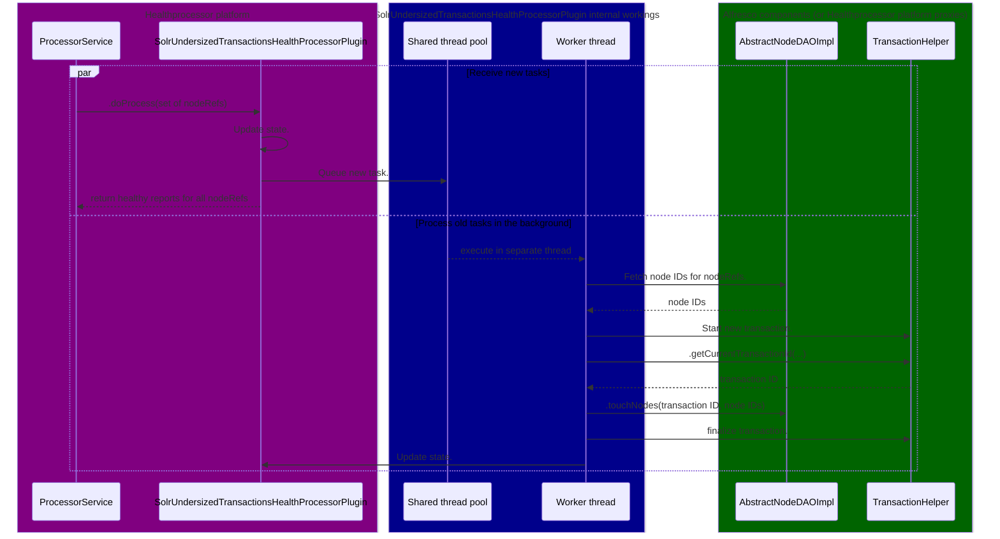

```mermaid
sequenceDiagram
    box Purple Healthprocessor platform
    participant ProcessorService
    participant SolrUndersizedTransactionsHealthProcessorPlugin
    end
    box Darkblue SolrUndersizedTransactionsHealthProcessorPlugin internal workings
    participant Shared thread pool
    participant Worker thread
    end
    box Darkgreen Alfresco components (or Healthprocessor platform proxies)
    participant AbstractNodeDAOImpl
    participant TransactionHelper
    end

    par Receive new tasks
        ProcessorService->>SolrUndersizedTransactionsHealthProcessorPlugin: .doProcess(set of nodeRefs)
        SolrUndersizedTransactionsHealthProcessorPlugin->>SolrUndersizedTransactionsHealthProcessorPlugin: Update state.
        SolrUndersizedTransactionsHealthProcessorPlugin->>Shared thread pool: Queue new task.
        SolrUndersizedTransactionsHealthProcessorPlugin-->>ProcessorService: return healthy reports for all nodeRefs
    
    and Process old tasks in the background
        Shared thread pool-->>Worker thread: execute in separate thread
        Worker thread->>AbstractNodeDAOImpl: Fetch node IDs for nodeRefs.
        AbstractNodeDAOImpl-->>Worker thread: node IDs
        Worker thread->>TransactionHelper: Start new transaction.
        Worker thread->>TransactionHelper: .getCurrentTransactionId(...)
        TransactionHelper-->>Worker thread: transaction ID
        Worker thread->>AbstractNodeDAOImpl: .touchNodes(transaction ID, node IDs)
        Worker thread->>TransactionHelper: finalize transaction.
        Worker thread->>SolrUndersizedTransactionsHealthProcessorPlugin: Update state.
    end
```